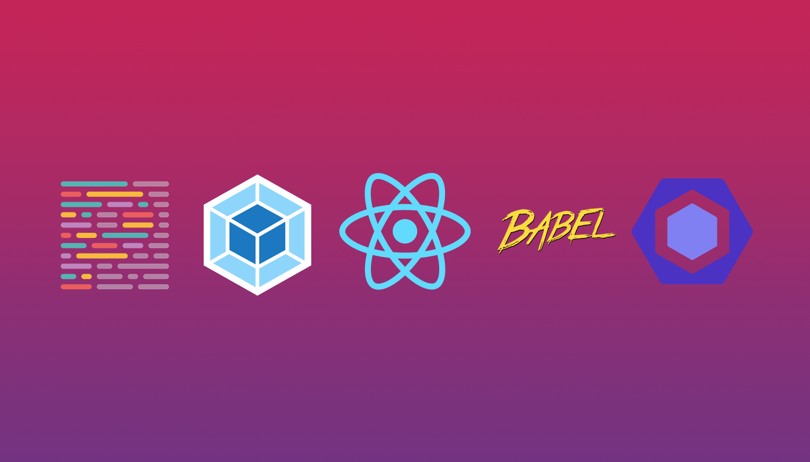

# React from scratch

A React boilerplate repo using Webpack 4, Babel, Eslint and Prettier. The repo was created for [this](https://medium.com) blog post on [Medium]((https://medium.com)).


## Usage

Clone the repo and type the following commands to run the app:

```
yarn && yarn start
```
